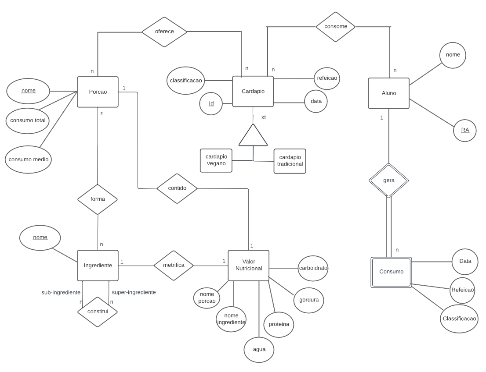

# Equipe PLAY

# Subgrupo ANCHO
* André Santos Rocha - 235887
* Mariano Cho- 230797

## Modelo Conceitual ER

*Diagrama ER Original*

*Diagrama ER Revisado*

## Mapeamento para o Modelo Relacional
~~~
CARDAPIO(_Id_,Data , Refeicao, Classificacao)
ALUNO(_RA_,nome)
PORCAO(_Nome_,Consumo Total, Consumo Medio)
INGREDIENTE(_Nome_)
VALOR NUTRICIONAL(_Nome_Porcao_, _Nome_Ingrediente_, agua, proteina, carboidrato, gordura)
	Nome Porcao chave estrangeira -> PORCAO(Nome)
	Nome Ingrediente chave estrangeira -> INGREDIENTE(Nome)

FORMA(_Nome_Porcao_, Nome_Ingrediente_)
	Nome Porcao chave estrangeira -> PORCAO(NOME)
	Nome Ingrediente chave estrangeira -> INGREDIENTE(NOME)

CONSTITUI(_Super_, _Sub_)
  Super chave estrangeira -> Ingrediente(Nome)
  Sub chave estrangeira -> Ingrediente(Nome)

CONSUMO(_Ra_, _Id_Cardapio_, Data, Refeicao, Classificacao)
	Ra chave estrangeira -> ALUNO(RA)
	Id Cardapio chave estrangeira -> CARDAPIO(Id)

OFERECE(_Id_Cardapio_, _Nome_Porcao_)
	Id Cardapio chave estrangeira -> CARDAPIO(Id)
	Nome Porcao chave estrangeira -> PORCAO(Nome)
~~~
