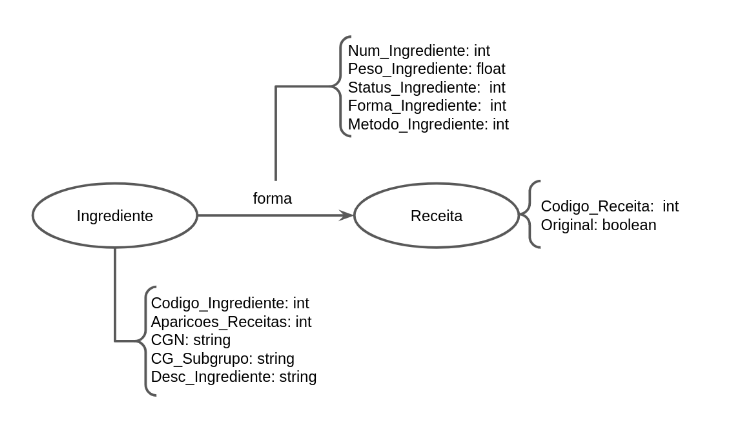

# Equipe PLAY

# Subgrupo ANCHO
* André Santos Rocha - 235887
* Mariano Cho - 230797

## Modelo Lógico do Banco de Dados de Grafos

## Perguntas de Pesquisa/Análise
 * Quais os ingredientes mais/menos populares (que aparecem em mais/menos receitas)?
 * Um determinado ingrediente X é mais utilizado cru, cozido ou refinado?
 * Quais receitas apresentam pelo menos metade de seu peso composto por um determinado CGN (grupo de ingredientes)?
