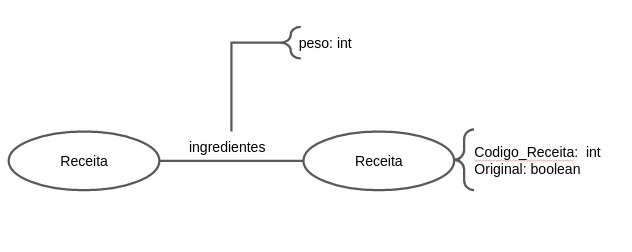

# Equipe PLAY
# Subgrupo ANCHO
* André Santos Rocha - 235887
* Mariano Cho - 230797

## Modelo Lógico do Banco de Dados de Grafos
> Primeiro realizaremos uma transformação. Faremos uma projeção, transformando nosso grafo bipartido em um homogêneo, tornando ingredientes como propriedade das arestas e receitas como os nós, conectando receitas que compartilham ao menos 3 ingredientes. Com isso, tornamos o grafo mais adequado para um mapeamento por coexistência, identificando em quais receitas os ingredientes mais aparecem. 
>
> 

## Perguntas de Pesquisa/Análise Combinadas e Respectivas Análises

### Pergunta/Análise 1
> * Quais receitas apresentam os ingredientes mais versáteis? Isto é, quais são as receitas cujos ingredientes permitem produzir o maior número de outras receitas?
> 
>   * A partir da análise do grafo, considerando o “degree centrality” de uma receita, podemos descobrir o quão versátil são seus ingredientes. Isso porque, quanto maior seu “degree centrality”, maior o número de receitas produzidas a partir de seus próprios ingredientes.

### Pergunta/Análise 2
> * É possível classificar as receitas em diferentes grupos baseado nos seus ingredientes?
>   
>   * Observando o grafo, é possível notar que existem comunidades de receitas, ou seja, há subgrafos de receitas que exibem mais conexões entre si do que com o restante do grafo. A partir disso, é possível caracterizar as receitas em diferentes grupos, tendo em vista os ingredientes que apresentam. Por exemplo: receitas veganas, receitas doces, receitas proteicas, etc.

### Pergunta/Análise 3
> * É possível sugerir uma dieta diversificada para uma determinada pessoa, sabendo que ela gosta de uma certa receita?
>   
>   * Baseando-se nas comunidades existentes no grafo, é possível propor uma dieta diversificada para uma certa pessoa. Para isso, basta procurar por um “motif”, que, nesse caso, serão formas fechadas, onde cada um de seus nós pertençam a diferentes comunidades. Dessa forma, caso a pessoa goste de pelo menos uma receita (nó) do “motif”, aumentam-se as chances dela também gostar das receitas dos outros grupos, já que estas se relacionam com a receita preferida.
